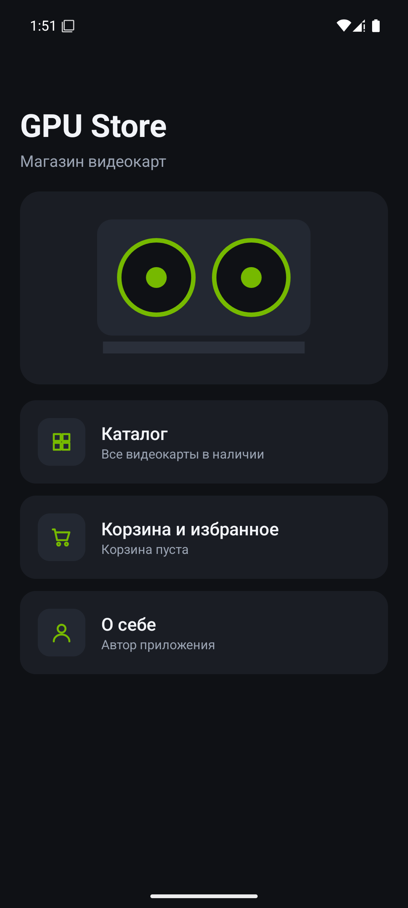
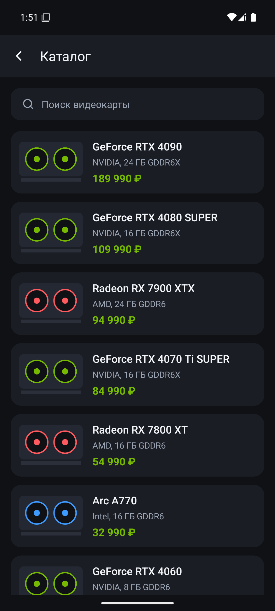
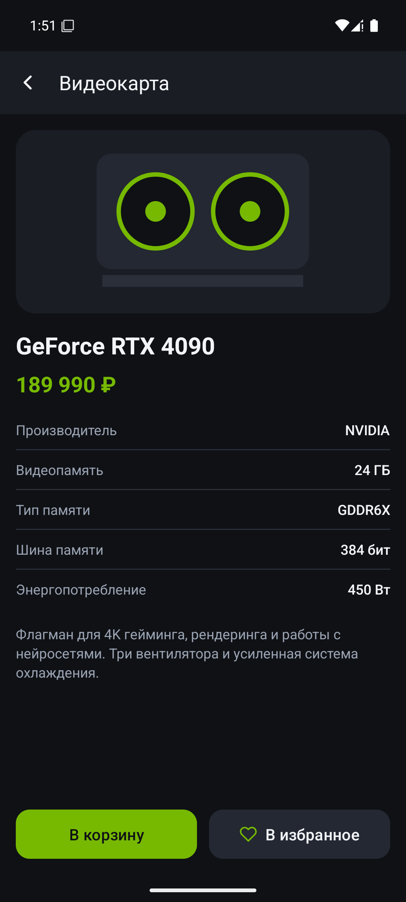
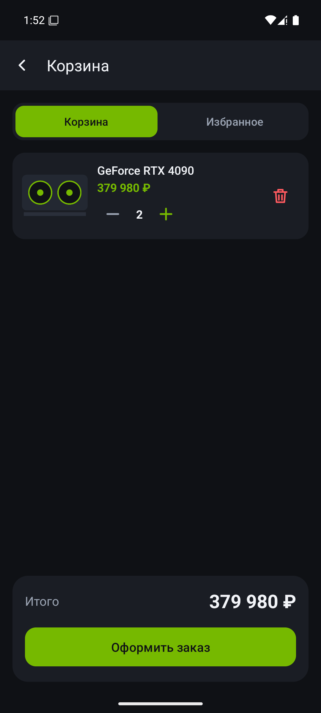
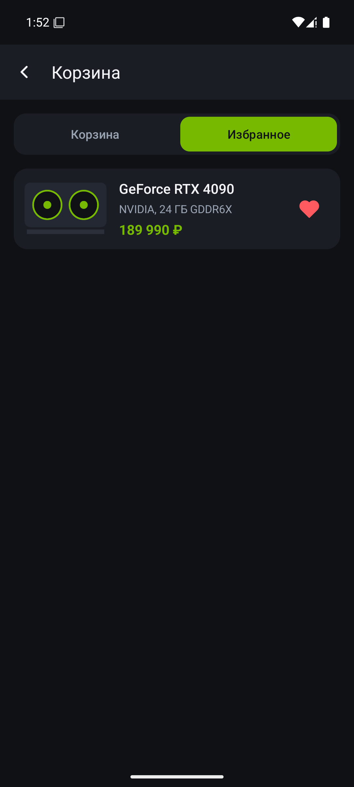
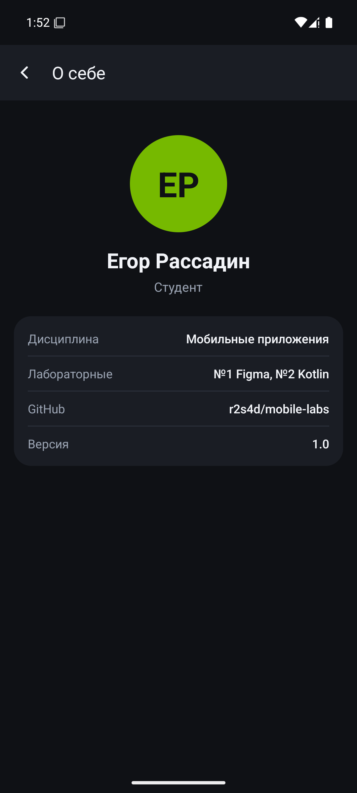

# GPU Store: магазин видеокарт

Две лабораторные работы по дисциплине «Разработка мобильных приложений»:

1. **Лаба 1.** Макет мобильного приложения в Figma.
2. **Лаба 2.** Android-приложение на Kotlin с базой данных, повторяющее макет.

Макет в Figma: <https://www.figma.com/design/DJhhySRXs6tsRLib7rnRcT>
(страница `Screens`: 5 экранов со связями прототипа, страница `Components`: общие компоненты).

## Что умеет приложение

| Экран | Класс | Что делает |
|---|---|---|
| Главное меню | `MenuActivity` | Стартовый экран, переходы в каталог, корзину и «О себе», счетчик товаров в корзине |
| Каталог | `MainActivity` | Список всех видеокарт из базы данных, поиск по названию |
| Карточка | `ItemActivity` | Характеристики, цена, кнопки «В корзину» и «В избранное» |
| Корзина и избранное | `CartActivity` | Две вкладки, изменение количества, удаление, итоговая сумма, оформление заказа |
| О себе | `AboutActivity` | Информация об авторе |

Переходы: меню → каталог → карточка → корзина, а также меню → корзина и меню → «О себе».

## Скриншоты

| Меню | Каталог | Карточка |
|---|---|---|
|  |  |  |

| Корзина | Избранное | О себе |
|---|---|---|
|  |  |  |

Экспорт экранов макета лежит в папке [`figma/`](figma).

## Технологии

- **Kotlin**, XML-разметка, ViewBinding, Material 3, RecyclerView
- **Room** (надстройка над SQLite): три таблицы `graphics_cards`, `cart_items`, `favorite_items`
- **ViewModel + Kotlin Coroutines + Flow**: экраны автоматически обновляются при изменении данных в базе
- Тесты: unit-тест форматирования цены, тесты запросов к базе (Room in-memory), сквозной UI-тест на Espresso

## Архитектура

```
Activity (ui/)  →  ViewModel (ui/ViewModels.kt)  →  StoreRepository  →  StoreDao (Room)  →  SQLite
```

Каждый слой знает только о соседнем: экран ничего не знает про SQL, база ничего не знает про экраны.

```
app/src/main/java/ru/gpustore/app/
  StoreApp.kt            класс приложения: база и первичное заполнение каталога
  data/                  сущности, DAO, база, репозиторий, начальные данные
  ui/                    пять Activity, адаптеры списков, ViewModel
  util/                  форматирование цены, подбор иллюстрации, отступы под системные панели
exam/                    конспекты к зачету (вопросы 1-26)
figma/                   экспорт экранов макета
screenshots/             скриншоты работающего приложения
```

## Как запустить

### Android Studio

1. Открыть папку проекта через **File → Open**. Android Studio сама скачает Gradle и зависимости.
2. Выбрать устройство (эмулятор или телефон с включенной отладкой по USB) и нажать **Run**.

### Командная строка

Нужны JDK 17 и Android SDK (путь к SDK в файле `local.properties`: `sdk.dir=...`).

```bash
./gradlew installDebug             # собрать и установить на подключенное устройство
./gradlew testDebugUnitTest        # unit-тесты (без устройства)
./gradlew connectedDebugAndroidTest  # тесты на эмуляторе или телефоне
```

Минимальная версия Android: 8.0 (API 26).

## Требования заданий и где они выполнены

**Лаба 1 (Figma):** главное меню, каталог, карточка с добавлением в избранное и корзину, корзина и избранное, «О себе». См. ссылку выше и папку `figma/`.

**Лаба 2 (Kotlin):**
- Проект Android Studio, язык Kotlin.
- Больше трех Activity с переходами между ними: `MenuActivity`, `MainActivity`, `ItemActivity`, `CartActivity`, `AboutActivity`.
- Главная форма со списком всех товаров: `MainActivity`.
- Форма одного товара: `ItemActivity`.
- Корзина и избранное: `CartActivity`.
- База данных: локальная SQLite через Room (`data/`). Товары, корзина и избранное хранятся в базе и сохраняются между запусками.

## Данные об авторе

Имя, роль и остальные сведения для экрана «О себе» меняются в `app/src/main/res/values/strings.xml` (блок `about_*`).
